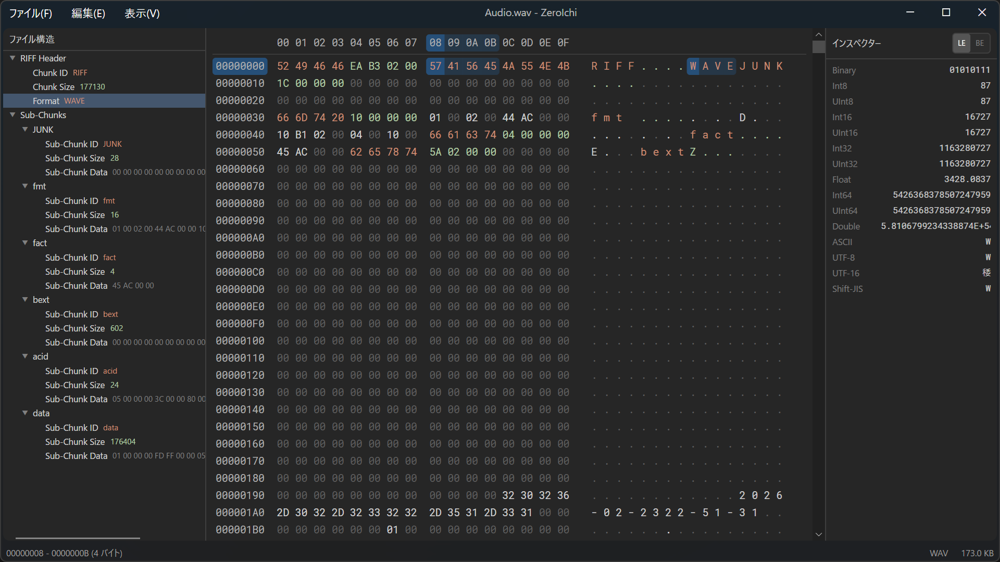

# ZeroIchi

クロスプラットフォーム対応のバイナリエディタ

[](LICENSE)


## 概要

ZeroIchi は、[Avalonia UI](https://avaloniaui.net/) ベースのバイナリエディタです。



## システム要件

- [.NET 10 SDK](https://dotnet.microsoft.com/download)

### プラットフォーム

| OS | 状況 |
|---|---|
| Windows | 動作確認済み |
| macOS | 対応中 |
| Linux | 対応中 |

## ビルドと実行

```bash
git clone https://github.com/oruponu/ZeroIchi.git
cd ZeroIchi
dotnet run --project src/ZeroIchi
```

## ライセンス

[MIT License](LICENSE)
